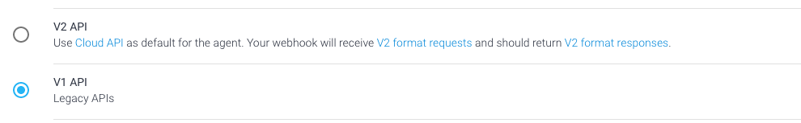
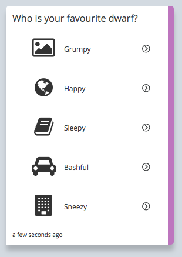

# Getting Started with the ServisBOT Portal
The ServisBOT portal is the perfect starting point for getting used to the various aspects of the platform. It is also where Classic Flow bots are easiest to manage.

## Creating your first bot
It is easy to create your first bot by using a template from within the portal. Make sure you have the  [Definitions](definitions.md) and  [Definitions](README.md) such as a portal account before starting.

1. ***Navigate to the Bot designer tab.***
This page lists all bots that have been created.

2. ***In the top right, click "Create Bot"***
You will be provided with a list of available blueprints to get started with. The easiest to work with is the "Classic Flow Bot" which provides you with a flow-based interaction right out of the bat. There are many more blueprints, some of which mix weave one or more workers.

3. ***After selecting the classic flow blueprint and clicking next you will be able to configure bots.***
Classic flow bots allow you to pick a persona, great for identifying your bot quickly when on the landing page. You can also set the initial message, and a description. This configuration screen will change depending on what bot you select.

4. ***Build and test your bot***
Hopefully everything went well. On this screen you can test the bot which will open an preview screen.
After playing around with the bot click edit so that you can get familiar with how this bot is set up

5. ***Edit your bot***
Classic Flow bots use a drag and drop interface to manage a bot conversation. This can be powerful when prototyping an experience, or providing a thinly sliced use-case to a user which requires a series of steps to be completed. You can learn more details about the flow and how to manage bots [here](class-flow-overview.md).

## Creating a font-end experience for a Dialogflow bot.
You can provide a ServisBOT skin to an new or existing Dialogflow bot with a few simple steps. The main difference is that the process to create the bot should start in Dialogflow. Managing the intent will happen there too. The main benefit of wrapping a Dialogflow bot with a ServisBOT experience is the ability for the bot to use [markup](timeline-markup.md), and how quickly it is to get a front end up and running

1. ***Create a brand new agent in Dialogflow*** Best instructions are [here](https://dialogflow.com/docs/getting-started/first-agent)
2. ***Create your DialogFlow Secret***
  1. In Dialogflow, Click on the gear next to your agent's name.
  
  2. Grab the "Project ID" and "Client Access Token"
    1. You might need to select (use V1 API)
    
  3. In ServisBOT Portal, go to "Secrets Management" and click "Create Secret" in the top right.
  4. provide an easy to remember alias for this bot, select the Dialogflow V1 Template and fill in your project ID and access key. Hit save when done.
3. ***Build your bot.***
  1. Navigate to the Bot designer and click "Create Bot"
  2. Select the "DialogFlow Bot" Blueprints
  3. Name your bot and select the secret you created in the previous screen
  4. Build it!
4. ***Test and adjust your bot***
  1. On the confirmation screen you will find a button to test your bots
  2. Send the bot a message
  3. You can add additional intents directly in Dialogflow, the bot will immediately understand those UserIntents
5. ***Use some markup***
  1. For one of your intents, drop in some markup as a response
  ```
  <TimelineMessage>
    <List selectable="true" title="Who is your favourite dwarf?" style="large-icon">
      <Item id="0" title="Grumpy" iconUrl="https://imgplaceholder.com/48x48/ffffff/333333/fa-image" />
      <Item id="1" title="Happy" iconUrl="https://imgplaceholder.com/48x48/ffffff/333333/fa-globe" />
      <Item id="2" title="Sleepy" iconUrl="https://imgplaceholder.com/48x48/ffffff/333333/fa-book" />
      <Item id="3" title="Bashful" iconUrl="https://imgplaceholder.com/48x48/ffffff/333333/fa-car" />
      <Item id="4" title="Sneezy" iconUrl="https://imgplaceholder.com/48x48/ffffff/333333/fa-building" />
    </List>
  </TimelineMessage>
  ```
  2. When you test that intent again, the bot should respond with a visual tile instead of text.

  
