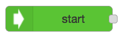
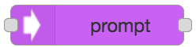

# Classic Flow Node Library
The following document provides description about the different nodes offered within the flow designer canvas palette. This includes use cases and instruction on each node to inform users on how and where to use each node, along with their benefits.

|   Node   | Category | Description |
|-------------|----------|-------------|
|  Start     |   General       | The “Start” node is used at the point in which the user would like the BOT to begin from. Without a “Start” node, the BOT will be unable to trigger any of the flows it may have. |      
| Dialogue | General         |For a BOT to deliver a message for users to see, we need to implement a “Dialogue” node. Once this has been placed onto the node red canvas, double click this node. 	From here, you shall see a text input field in which you can add and customise messages delivered into messenger by the BOT. |    
|  Input     |     General     | By placing an “Input” node into the flow, this tells the BOT to wait for a customer message within messenger. Once a user has entered a message the BOT will then proceed with the rest of the flow. A common use case for this is when the BOT requires information from the user of some form. This would then be followed by some sort of validation, which this documentation shall cover further on.|   
|   Prompt   | General         |This tells the Bot to wait for the user to enter something within messenger before executing any parts of the flow after this node. This input node can be validated by placing a “Function” node afterwards to verify what the user may type. A “Prompt” node is how a Bot can deliver a menu or list of interactive options to the user through messenger for them to choose from. |
|  Link   |   General       |	Flows within a BOT can quite easily become large and take up a lot of space within a node red canvas, this is why we use different flows and sub-flows to separate these canvases containing different paths.| |
| ![Goal] (images/goal.png) Goals     |    General      | In order to see the amount of traffic that is coming to a certain point within your bot, you can add a "Goal" node to the flow. This will collect data on when users reach that certain point within the flow, along with dates, times and the conversation ID. You can rename the goal to be recognisable by your business by double clicking the node and giving it a name within the text input field. |