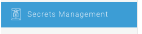

#Managing Secrets
Secrets are secure documents containing access keys, api keys, api secrets or IDs to external systems. They can be created and stored in the servisbot system and then referenced by bots or BaaS securely. This is perfect for managing API keys for AWS, or project references for Dialogflow.

Secrets can only be created or deleted. They can also be managed by both the CLI and portal


## Secret Properties
***Alias***
The alias is what is used to reference this secure doc in the system.
***Type:***
There are two types of secrets:
* SecretDoc: a non-scalar array in JSON, better for project specific config.
* A simple string. Good for API keys

***SRN***
A unique identifier for the ServisBOT system

## Managing Secrets in Portal
In portal, a list of all currently created secrets can be seen by navigating to the "Secrets Management Section".


There you can see a list of secrets and their create date.

To create a secret, you will need to gather a couple of things from the external service you are planning on connecting to.

The secret body is what contains your keys. We have some ServisBOT templates available for common secret types.

***For AWS***
```
{
  "awsAccessKey": "some-access-key",
  "awsSecretAccessKey": "some-secret-key",
  "awsRegion": "some-aws-region"
}
```
***For Dialogflow V1***
```
{
  "accessToken": "some-access-token",
  "projectId": "someproject-id"
}
```


## Managing Secrets in the Cli
After logging in to the CLI, you can create a secret by providing either a JSON file or string. There are no prebuilt templates available.

You can also list, delete and describe a secret. Describing a secret does not show you the contents of the document, merely the alias, srn and type.

```
sb-cli secret create secret.json
```
