# Timeline Markup
Timeline markdown is used to send advanced UI elements from our design kit to users.

Timeline Markup can be combined with "context" from other sources and using Apache's Velocity Template Language you can dynamically assemble an interface using a number of existing components.

Timeline Markup is strict XML. All the rules of XML apply and an XML validator will at least tell you if your markup is well formed.

An example of the TimelineMessage element is:
```
<TimelineMessage>
  <TextMsg>Hello</TextMsg>
</TimelineMessage>
```

## Table of Contents
* [TextMsg](#TextMsg)
* [List](#List)
  - Vertical List, No Icons
  - Vertical List with Icons
* [Carousel](#Carousel)
  - Large Carousel, Selectable Options
  - Large Carousel, No Options
  - Small Carousel
* [Item](#Item)
* [Card](#Card)
* [Broadcast](#)
* [Option](#Option)
* [DetailView](#DetailView)
* [SuggestionPrompt](#SuggestionPrompt)
* [StaticMap](#StaticMap)
* [Generated JSON object](#Generated JSON object)

### TextMsg

* A entry in the conversation for displaying text
* It takes the text as a child of the component
* It takes no parameters

An example of TextMsg markup is:
```
<TimelineMessage>
  <TextMsg>Hello there!</TextMsg>
  <TextMsg>Whats your name?</TextMsg>
</TimelineMessage>
```
### List

* A List is a simple list of things
* The List can be simple text, pair text with icons or pair text with images
* The List can also allow the user to select one of the list items

The parameters for a List are:
* title	- (string) the title text for the list
* style - (string) the style of list that you would like
  - Options: standard, small-icon, large-ico
  - Default: standard
* selectable	(boolean) whether the list items should be select-able
* horizontal	(boolean) whether the list displays as horizontal scroll-able list of images

The List can look differently depending on the combination of parameters passed to it.

#### Vertical List, No Icons
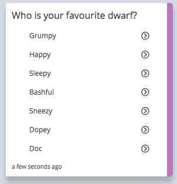

To make a vertical list with no icons the markup is:
```
<TimelineMessage>
  <List selectable="true" title="Who is your favourite dwarf?" style="standard">
    <Item id="0" title="Grumpy" />
    <Item id="1" title="Happy" />
    <Item id="2" title="Sleepy" />
    <Item id="3" title="Bashful" />
    <Item id="4" title="Sneezy" />
    <Item id="5" title="Dopey" />
    <Item id="6" title="Doc" />
  </List>
</TimelineMessage>
```

#### Vertical List with Icons

The new parameters for a list item with an Icon are:
* iconUrl	(string) the url of an icon image
* Small Icons: N x N px
* Large Icons: N x N px


To make a vertical list with small inline icons the markup is:
```
<TimelineMessage>
  <List selectable="true" title="Who is your favourite dwarf?" style="small-icon">
    <Item id="0" title="Grumpy" iconUrl="https://imgplaceholder.com/18x18/ffffff/333333/fa-image" />
    <Item id="1" title="Happy" iconUrl="https://imgplaceholder.com/18x18/ffffff/333333/fa-globe" />
    <Item id="2" title="Sleepy" iconUrl="https://imgplaceholder.com/18x18/ffffff/333333/fa-book" />
    <Item id="3" title="Bashful" iconUrl="https://imgplaceholder.com/18x18/ffffff/333333/fa-car" />
    <Item id="4" title="Sneezy" iconUrl="https://imgplaceholder.com/18x18/ffffff/333333/fa-building" />
  </List>
</TimelineMessage>
```

To make a vertical list with large icons the markup is:

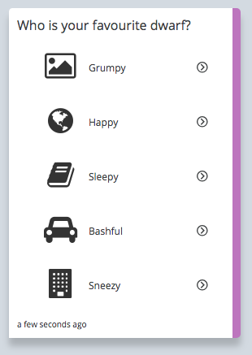
```
<TimelineMessage>
  <List selectable="true" title="Who is your favourite dwarf?" style="large-icon">
    <Item id="0" title="Grumpy" iconUrl="https://imgplaceholder.com/48x48/ffffff/333333/fa-image" />
    <Item id="1" title="Happy" iconUrl="https://imgplaceholder.com/48x48/ffffff/333333/fa-globe" />
    <Item id="2" title="Sleepy" iconUrl="https://imgplaceholder.com/48x48/ffffff/333333/fa-book" />
    <Item id="3" title="Bashful" iconUrl="https://imgplaceholder.com/48x48/ffffff/333333/fa-car" />
    <Item id="4" title="Sneezy" iconUrl="https://imgplaceholder.com/48x48/ffffff/333333/fa-building" />
  </List>
</TimelineMessage>
```

### Carousel
#### Large Carousel, Selectable Options
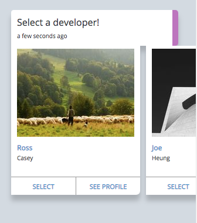

To make a large horizontal list (or carousel) with selectable options, the markup is:
```
<TimelineMessage>
  <List title="Select a developer!" horizontal="true" selectable="true" style="large-icon">
    <Item title="Grumpy" subtitle="the dwarf" id="1" imageUrl="https://picsum.photos/200/150/?random&amp;a">
      <Option title="Select" id="Grumpy" />
      <Option title="See Profile" url="https://servisbot.com/about/" urlTitle="Profile"/>
    </Item>
    <Item title="Happy" subtitle="the dwarf" id="2" imageUrl="https://picsum.photos/200/150/?random&amp;b">
      <Option title="Select" id="Happy" />
      <Option title="See Profile" url="https://servisbot.com/about/" urlTitle="Profile"/>
    </Item>
    <Item title="Sleepy" subtitle="the dwarf" id="3" imageUrl="https://picsum.photos/200/150/?random&amp;c">
      <Option title="Select" id="Sleepy" />
      <Option title="See Profile" url="https://servisbot.com/about/" urlTitle="Profile"/>
    </Item>
    <Item title="Bashful" subtitle="the dwarf" id="4" imageUrl="https://picsum.photos/200/150/?random&amp;d">
      <Option title="Select" id="Bashful" />
      <Option title="See Profile" url="https://servisbot.com/about/" urlTitle="Profile"/>
    </Item>
    <Item title="Sneezy" subtitle="the dwarf" id="5" imageUrl="https://picsum.photos/200/150/?random&amp;e">
      <Option title="Select" id="Sneezy                      " />
      <Option title="See Profile" url="https://servisbot.com/about/" urlTitle="Profile"/>
    </Item>
  </List>
</TimelineMessage>
```
#### Large Carousel, No Options
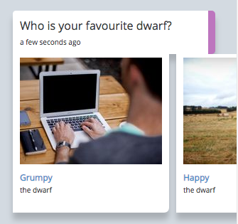

To make a large horizontal list (or carousel) with no options, the markup is:
```
<TimelineMessage>
  <List selectable="true" horizontal="true" title="Who is your favourite dwarf?" style="large-icon">
    <Item id="0" title="Grumpy" subtitle="the dwarf" imageUrl="https://picsum.photos/200/150/?random&amp;a" />
    <Item id="1" title="Happy" subtitle="the dwarf" imageUrl="https://picsum.photos/200/150/?random&amp;b" />
    <Item id="2" title="Sleepy" subtitle="the dwarf" imageUrl="https://picsum.photos/200/150/?random&amp;c" />
    <Item id="3" title="Bashful" subtitle="the dwarf" imageUrl="https://picsum.photos/200/150/?random&amp;d" />
    <Item id="4" title="Sneezy" subtitle="the dwarf" imageUrl="https://picsum.photos/200/150/?random&amp;e" />
    <Item id="5" title="Dopey" subtitle="the dwarf" imageUrl="https://picsum.photos/200/150/?random&amp;f" />
    <Item id="6" title="Doc" subtitle="the dwarf" imageUrl="https://picsum.photos/200/150/?random&amp;g" />
  </List>
</TimelineMessage>
```

#### Small Carousel
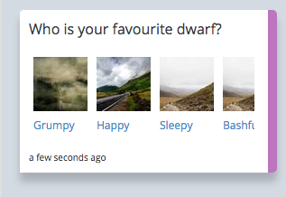

To make a small horizontal list (or carousel) the markup is:
```
<TimelineMessage>
  <List selectable="true" title="Who is your favourite dwarf?" style="small-icon" horizontal="true">
    <Item id="0" title="Grumpy" imageUrl="https://picsum.photos/60/60/?random&amp;a" />
    <Item id="1" title="Happy" imageUrl="https://picsum.photos/60/60/?random&amp;b" />
    <Item id="2" title="Sleepy" imageUrl="https://picsum.photos/60/60/?random&amp;c" />
    <Item id="3" title="Bashful" imageUrl="https://picsum.photos/60/60/?random&amp;c" />
    <Item id="4" title="Sneezy" imageUrl="https://picsum.photos/60/60/?random&amp;d" />
    <Item id="5" title="Dopey" imageUrl="https://picsum.photos/60/60/?random&amp;e" />
    <Item id="6" title="Doc" imageUrl="https://picsum.photos/60/60/?random&amp;f" />
  </List>
</TimelineMessage>
```
If an Item has option children and those Options have a "url" parameter, it will open that url in a new window in the messenger.
Item

* An Item is contained in a list
* Each Item corresponds to a single entry in a List
* An item can have text with either an icon or an image

The parameters for Item are:
* title	(string) the text you would like to appear in the Item
* subtitle	(string) a subtitle that appears below the text on the when "horizontal=true" and "style=large-icon" on a List component
* id	(string) the identifier for this Item to be used in selection
* iconUrl	(string) the URL of the icon you want to appear with the Item when "horizontal=false"
* imageUrl	(string) the URL of the image you want to appear with the item when "horizontal=true"


An example of Item markup is:
```
<TimelineMessage>
  <List selectable="true" title="Who is your favourite dwarf?">
     <Item title="My item" id="item-1" iconUrl="https://picsum.photos/48/48/?random&amp;f" />
  </List>
</TimelineMessage>
```

See also: List

### Card
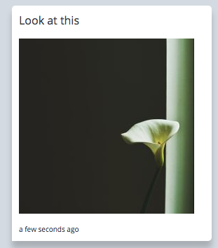

A Card is a way of showing a single image

The parameters for Card are:
* title	(string) the title text for the Card
imgUrl	(string) the URL the image will be loaded from - 250x250px works best
* imgData	(string) A base64 encoded version of an image, if imgUrl is set this will not be used
* alt	(string) the text that describes the image

An example of Card Markup is:
```
<TimelineMessage>
  <Card title="Look at this" imgUrl="https://picsum.photos/250/250/?random&amp;g" alt="Lovely image" />
</TimelineMessage>
```

#### Broadcast
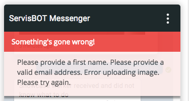

A temporary message displayed at the top of the feed

The parameters for Broadcast are:
* Style - (string) the style of the message
* Options: error, warning, info
* title	- (string) the title of the message
* body	- (string) the body of the message
* delay - (string) (optional) the number of seconds the message should be displayed

If not supplied, the delay will be calculated based on the combined length of the title and the body of the message.

An example of Broadcast Markup is:
```
<TimelineMessage>
  <BroadcastMsg
      style="error"
      title="Something's gone wrong!"
      body="Please provide a first name. Please provide a valid email address. Error uploading image. Please try again."
      delay="5"
    />
</TimelineMessage>
```

#### Option
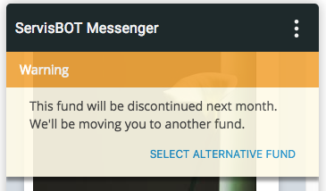

A call to action displayed at the bottom of the broadcast message.

The parameters for Option are:
* title	(string) the title of the message
* id	(string) identifier for the action
* url	(string) url which can be opened in a webview instead of triggering a markup interaction
* urlTitle	(string) the title of the webview that the url will be opened in

An example of Option Markup is:
```
<TimelineMessage>
 <BroadcastMsg
   title="Warning"
   body="This fund will be discontinued next month. We'll be moving you to another fund."
   style="warning">
     <Option title="Select alternative fund" id="1234" />
  </BroadcastMsg>
</TimelineMessage>
```
See also: BroadcastMsg, SuggestionPrompt, List


#### DetailView
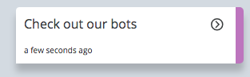

A call to action that opens a web page in an iFrame

The parameters for DetailView are:
* url	(string) the url you want to open in the iFrame
* description:	(string) the description that appears on the call to action
* title	(string) the title that appears at the top of the iFrame

An example of DetailView markup is:
```
<TimelineMessage>
  <DetailView
    title="ServisBOT"
    description="Check out our bots"
    url="https://servisbot.com"
  />
</TimelineMessage>
```

#### SuggestionPrompt
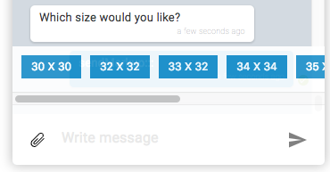

A call to action that presents the user with suggested responses to a question

The SuggestionPrompt doesn't take any parameters directly. It contains a list of options which have the suggested response set as the title parameter.

An example of SuggestionPrompt markup is:
```
<TimelineMessage>
  <SuggestionPrompt>
    <Option title="30 x 30" id="1111" />
    <Option title="32 x 32" id="2222" />
    <Option title="33 x 32" id="3333" />
    <Option title="34 x 34" id="4444" />
    <Option title="35 x 34" id="5555" />
    <Option title="v36 x 36" id="6666" />
    <Option title="v37 x 35" id="7777" />
    <Option title="v38 x 36" id="8888" />
  </SuggestionPrompt>
</TimelineMessage>
```

#### StaticMap
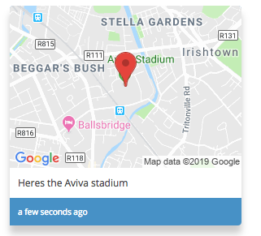

* A static Google Maps component
* Plots a pin on the map based on coordinates
* Requires a Google API key to be based into ServisBOT Messenger in the ServisBOT.init() function

The parameters for StaticMap are:
* description	(string) the description to be associated with the map e.g. the address
* lat	(string) the latitude co-ordinate of the pin to place on the map
* lng	(string) the longitude co-ordinate of the pin to place on the map

An example of StaticMap markup is:
```
<TimelineMessage>
  <StaticMap
    description="Heres the Aviva stadium"
    lat="53.335309"
    lng="-6.228413"
  />
</TimelineMessage>
```

#### Generated JSON object

The markupObject is being generated by the xml2js module. Given an XML that looks like this:
```
<TimelineMessage>
    <List style="icon" selectable="true">
    <Item id="SAVE" iconUrl="bank.ico" title="Savings Account" />
    <Item id="CREDIT" iconUrl="card.ico" title="Credit Account" />
    </List>
    <TextMsg>My 1st text message</TextMsg>
    <TextMsg>My 2nd text message</TextMsg>
</TimelineMessage>
```
The generated markupObject will look like this:
```
{
  "TimelineMessage": {
    "#name": "TimelineMessage",
    "children": [
      {
        "attributes": {
          "style": "icon",
          "selectable": "true"
        },
        "#name": "List",
        "children": [
          {
            "attributes": {
              "id": "SAVE",
              "iconUrl": "bank.ico",
              "title": "Savings Account"
            },
            "#name": "Item"
          },
          {
            "attributes": {
              "id": "CREDIT",
              "iconUrl": "card.ico",
              "title": "Credit Account"
            },
            "#name": "Item"
          }
        ],
      },
      {
        "content": "My 1st text message",
        "#name": "TextMsg"
      },
      {
        "content": "My 2nd text message",
        "#name": "TextMsg"
      }
    ],

  }
```
